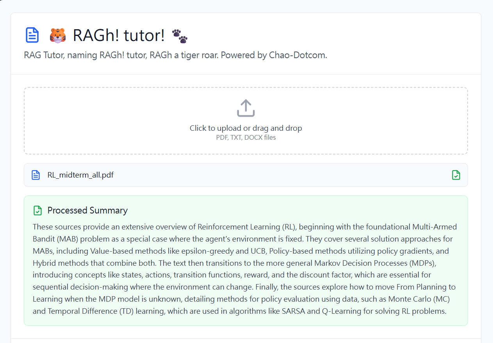

# RAGh-Tutor - Java Edition

A production-ready Retrieval-Augmented Generation (RAG) system built with **Java 17** and **Spring Boot 3**.

> **Note:** This is the Java implementation. For the Python version, see [legacy Python README](README-PYTHON.md).

## 🎥 Demo

[](https://youtu.be/8j4DqY873Ck)

Click the thumbnail above to watch the demo video!

## ✨ Features

- **🔍 Vector Search**: In-memory vector store with cosine similarity search
- **📄 Document Processing**: PDF, TXT, Markdown support with Apache PDFBox
- **🤖 Multiple LLM Providers**: OpenAI GPT-4, Anthropic Claude
- **💬 Conversation Memory**: Context-aware multi-turn conversations
- **⚡ Streaming Responses**: Server-Sent Events (SSE) for real-time streaming
- **📊 Metrics & Monitoring**: Prometheus/Grafana integration with Micrometer
- **🔒 Security**: Rate limiting, content moderation, audit logging
- **🚀 Performance**: Response caching, batch processing, performance profiling
- **📈 Analytics**: Query tracking, usage statistics, popular queries
- **🐳 Docker Support**: Full containerization with Docker Compose
- **📚 API Documentation**: Interactive OpenAPI/Swagger UI
- **🧪 Testing**: JUnit 5, Mockito, comprehensive test coverage

## 🚀 Quick Start

### Prerequisites

- Java 17 or higher
- Maven 3.6+
- OpenAI or Anthropic API key

### Installation

#### Option 1: Local Development

```bash
# 1. Set your API key
export OPENAI_API_KEY="your-api-key-here"

# 2. Build the project
mvn clean install

# 3. Run the application
mvn spring-boot:run

# 1. Add documents to the documents/ folder
cp your-document.pdf documents/

# 2. Index documents
curl -X POST http://localhost:8000/api/v1/index

# 3. Make your first query
curl -X POST http://localhost:8000/api/v1/query \
  -H "Content-Type: application/json" \
  -d '{"query": "What is retrieval augmented generation?", "topK": 5}'
```

## 📖 Documentation

- **API Docs**: http://localhost:8000/swagger-ui.html
- **Quick Start**: [guide/java-quick-start.md](guide/java-quick-start.md)
- **Migration Guide**: [guide/python-to-java-migration.md](guide/python-to-java-migration.md)
- **Full README**: [README-JAVA.md](README-JAVA.md)

## 🛠️ Configuration

Edit `src/main/resources/application.properties`:

```properties
# Server
server.port=8000

# LLM Settings
llm.provider=openai
llm.openai.api-key=${OPENAI_API_KEY}
llm.openai.model=gpt-4
llm.temperature=0.7
llm.max-tokens=2000

# Embedding
embedding.model=sentence-transformers/all-mpnet-base-v2
embedding.dimension=768

# Retrieval
retrieval.top-k=10
retrieval.mode=hybrid

# Chunking
chunking.size=800
chunking.overlap=200

# Security
security.rate-limit.enabled=true
security.rate-limit.requests=100
```

## 📡 API Endpoints

### Core Endpoints
- `GET /api/v1/health` - Health check
- `GET /api/v1/health/detailed` - Detailed health with component status
- `GET /api/v1/ready` - Kubernetes readiness probe
- `POST /query` - Query the knowledge base
- `POST /query/multi-document` - Query across multiple specific documents
- `POST /stream` - Streaming query (Server-Sent Events)
- `GET /docs` - Interactive API documentation (Swagger UI)

### Document Management
- `POST /documents/upload` - Upload and index a new document
- `POST /index` - Index all documents from documents folder

### Processing Endpoints
- `POST /process/audio` - Transcribe audio files
- `POST /process/image` - Extract text from images using OCR

### Conversation Management
- `GET /conversation/{session_id}/history` - Get conversation history
- `DELETE /conversation/{session_id}` - Clear conversation history

### Feedback & Analytics
- `POST /feedback` - Submit user feedback
- `GET /feedback/stats` - Get feedback statistics

### Monitoring & Metrics
- `GET /metrics` - Get system metrics (JSON)
- `GET /metrics/prometheus` - Prometheus metrics endpoint
- `WebSocket /ws/{client_id}` - WebSocket for real-time streaming

See `guide/quick-start.md` for full API reference.

## Monitoring & Observability

The system includes comprehensive monitoring capabilities:

- **Prometheus Metrics**: Export metrics at `/metrics/prometheus`
- **Health Checks**: Basic (`/health`) and detailed (`/health/detailed`) health endpoints
- **Performance Profiling**: Built-in performance profiler for optimization
- **Tracing**: Distributed tracing support
- **Query Analytics**: Track query patterns, performance, and usage statistics

### Monitoring Setup

With Docker Compose, Prometheus is automatically configured:
```powershell
# Access Prometheus UI
# http://localhost:9090
```

For production deployments, see `k8s/` directory for Kubernetes manifests with monitoring configured.

## Deployment

### Docker Production

Production-ready Docker Compose configuration is available:
```powershell
# Use production configuration
docker-compose -f docker/docker-compose.prod.yml up -d
```

### Kubernetes

Kubernetes deployment manifests are available in the `k8s/` directory:
- Deployment with horizontal pod autoscaling
- Service and Ingress configuration
- ConfigMap and Secrets management
- Persistent volume claims for data storage

## Documentation

- **Windows Setup**: `guide/windows-setup.md` ⭐ (No Make required - Windows-friendly commands)
- **Quick Start**: `guide/quick-start.md`
- **Docker Setup**: `guide/docker-setup-instructions.md`
- **Docker Quick Fix**: `guide/docker-quick-fix.md` (solves installation errors)
- **Troubleshooting**: `guide/troubleshooting.md`

## Project Structure

```
app/
├── main.py              # FastAPI application entry point
├── config.py            # Configuration management
├── dependencies.py      # Dependency injection
│
├── chunking/            # Document chunking strategies
│   ├── document_chunker.py
│   ├── semantic_chunker.py
│   └── specialized_chunker.py
│
├── embedding/           # Embedding generation
│   ├── embedding_model.py
│   ├── batch_embedder.py
│   └── multimodal_embedder.py
│
├── retrieval/           # Vector store and retrieval
│   ├── vector_store.py
│   ├── retrieval_pipeline.py
│   ├── hybrid_search.py
│   ├── reranker.py
│   └── query_expansion.py
│
├── generation/          # LLM integration
│   ├── llm_client.py
│   ├── prompt_builder.py
│   ├── response_parser.py
│   └── citation_tracker.py
│
├── agents/              # Agent orchestration
│   ├── rag_agent.py
│   ├── contextual_agent_executor.py
│   ├── tool_registry.py
│   ├── action_planner.py
│   └── tools/           # Agent tools
│       └── browser_tool.py
│
├── memory/              # Conversation management
│   ├── conversation_manager.py
│   ├── context_window_manager.py
│   ├── memory_store.py
│   └── summarizer.py
│
├── processing/          # Document processing
│   ├── document_loader.py
│   ├── pdf_processor.py
│   ├── audio_processor.py
│   ├── image_processor.py
│   ├── web_scraper.py
│   └── table_extractor.py
│
├── security/            # Security components
│   ├── content_moderation.py
│   ├── pii_detector.py
│   ├── rate_limiter.py
│   ├── auth.py
│   ├── audit_logger.py
│   └── action_budget.py
│
├── streaming/          # Streaming support
│   ├── sse_stream.py
│   ├── websocket_handler.py
│   └── stream_aggregator.py
│
├── monitoring/          # Observability & monitoring
│   ├── metrics.py
│   ├── health_checks.py

## 🧪 Testing

```bash
# Run all tests
mvn test

# Run with coverage
mvn clean test jacoco:report

# Run integration tests
mvn verify

# View coverage report
open target/site/jacoco/index.html
```

## 🚢 Deployment

### Docker Production

```bash
# Build production image
docker build -t rag-tutor:latest .

# Run with environment variables
docker run -d -p 8000:8000 \
  -e OPENAI_API_KEY=$OPENAI_API_KEY \
  -v ./documents:/app/documents \
  -v ./data:/app/data \
  rag-tutor:latest
```

### Kubernetes

Kubernetes manifests are available in the `k8s/` directory:
- Deployment with horizontal pod autoscaling
- Service and Ingress configuration
- ConfigMap and Secrets management
- Persistent volume claims

```bash
kubectl apply -f k8s/
```

## 📊 Monitoring

### Prometheus & Grafana

```bash
# Start with monitoring stack
docker-compose -f docker-compose-java.yml up -d

# Access dashboards
- Prometheus: http://localhost:9090
- Grafana: http://localhost:3000 (admin/admin)
- Metrics: http://localhost:8000/actuator/prometheus
```

### Metrics Tracked
- Query latency and throughput
- Retrieval performance
- LLM generation time
- Cache hit rates
- Error rates by type
- JVM metrics (heap, GC, threads)

## 🔒 Security Features

- ✅ **Rate Limiting**: Token bucket algorithm (100 req/min default)
- ✅ **Content Moderation**: Filters inappropriate content
- ✅ **Audit Logging**: Complete audit trail of operations
- ✅ **Action Budget**: Prevents abuse with session limits
- ✅ **Input Validation**: Bean Validation on all inputs
- ✅ **CORS Configuration**: Configurable cross-origin policies

## ⚡ Performance Features

- ✅ **Response Caching**: Caffeine cache for frequent queries
- ✅ **Batch Processing**: Efficient batch embedding generation
- ✅ **Connection Pooling**: HTTP client connection reuse
- ✅ **Async Operations**: CompletableFuture for parallel processing
- ✅ **Performance Profiling**: Detailed timing metrics

## 🔄 Migration from Python

Migrating from the Python version? See [Python to Java Migration Guide](guide/python-to-java-migration.md).

**Key Differences:**
- FastAPI → Spring Boot
- asyncio → CompletableFuture
- Pydantic → Lombok + Bean Validation
- FAISS → In-memory vector store
- Port: Same (8000)
- API: Compatible endpoints

## 🤝 Contributing

1. Fork the repository
2. Create a feature branch (`git checkout -b feature/amazing-feature`)
3. Commit changes (`git commit -m 'Add amazing feature'`)
4. Push to branch (`git push origin feature/amazing-feature`)
5. Open a Pull Request

## 📄 License

MIT License - See [LICENSE](LICENSE) file for details

## 🆘 Support

- 📖 [Documentation](guide/)
- 🐛 [Issue Tracker](https://github.com/yourusername/RAGh-Tutor/issues)
- 💬 [Discussions](https://github.com/yourusername/RAGh-Tutor/discussions)

## 🙏 Acknowledgments

- Original Python implementation
- Spring Boot framework
- LangChain4j library
- Apache PDFBox
- OpenAI & Anthropic

---

**Built with ☕ and Java 17**

